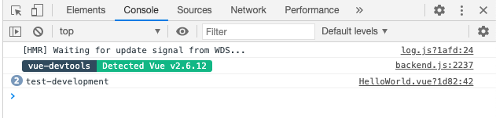
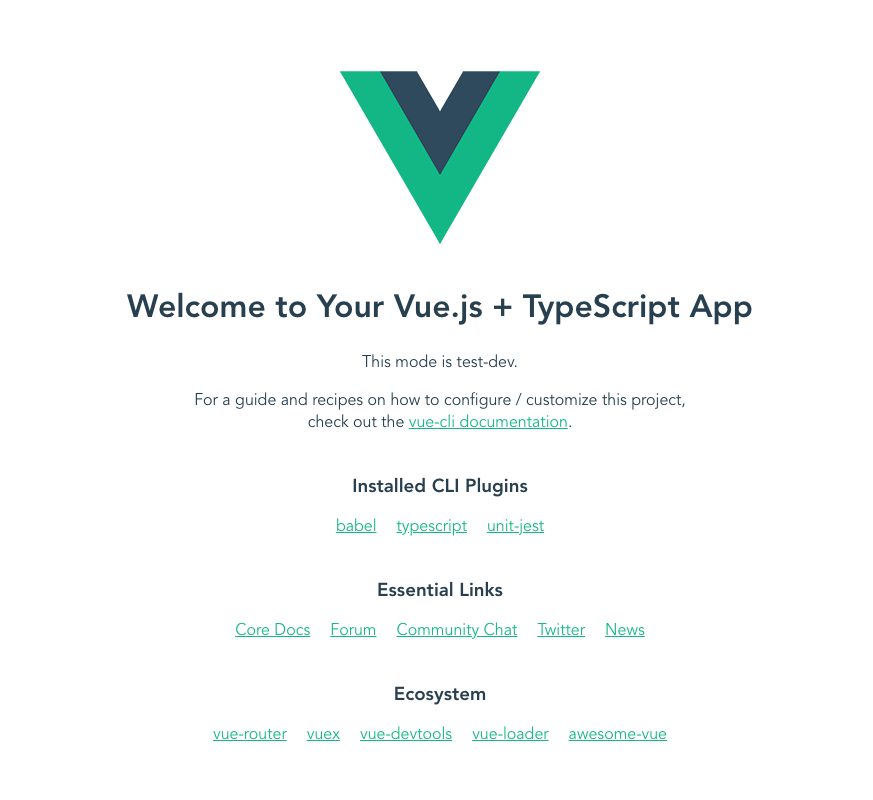

# Vueの起動モードについて

CIの特定タスクのときだけ独自の環境変数を使い、APIのモックは専用の物を使いたい！みたいなパターンが出てきたのでできないか調べてみた。

## 基本

`development`・`test`・`production`は予約語扱いになっている。

- https://cli.vuejs.org/guide/mode-and-env.html#modes

`--mode`オプションで環境を指定して切り替えている。
例：`vue-cli-service serve`を実行すると、裏では`--mode development`がついた状態で動いている。

## 環境変数をつける

`.env`ファイルにあれこれ記載して指定する。`.local`がつく場合、gitignoreされる。
`.env.[mode]`とつけると、`--mode`で指定した環境のみ実行される。

- https://cli.vuejs.org/guide/mode-and-env.html#environment-variables

### 実験してみる

1. `.env.test-dev`を作る
1. 作成した`.env`ファイルに以下記述する
    ```
    NODE_ENV=development
    VUE_APP_TITLE=test-development
    ```
1. Vueファイルに`process.env.VUE_APP_TITLE`のときだけ専用テキストを出力する処理を入れる
1. `vue-cli-service serve --mode test-dev`でアプリケーションを起動する
1. `test-dev`をつけたときだけ出力が変わるか確認する

### 結果

コミット番号`30fb1a891b42759f06c84573598cbe7343ad1f1b`の状態では出しわけできなかった。
`console.info(process.env.VUE_APP_TITLE);`環境変数を確認してみたところ、環境変数は`test-development`になっていた。



ただ、コード内で環境変数を`VUE_APP_TITLE === test-dev`として条件指定したが、実際は`test-development`なので条件に一致しない→出しわけできない状態になっていた（凡ミス）

```typescript
return process.env.VUE_APP_TITLE === 'test-dev' ? 'This mode is test-dev.' : '';
```

コミット`8af72802fe628108b7d6e1ddcbf43db1b13c1990`で変数名を修正し、`npm run test-dev`すると画面に`This mode is test-dev.`を表示できた。

